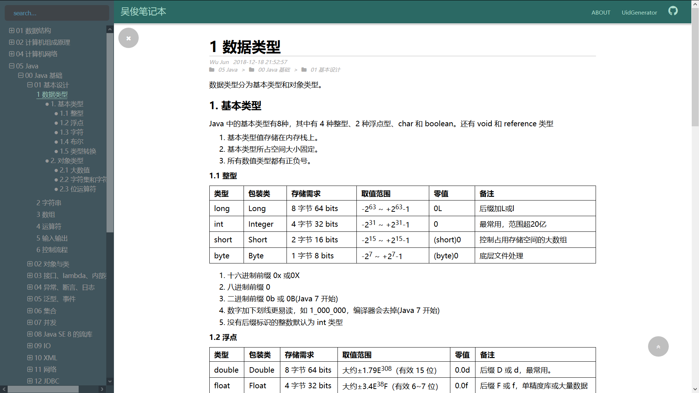

## Hexo 主题 Tree

一个简洁的主题，主要功能是 “树状导航” + “树状目录”，可选配“评论”和“阅读量”功能，支持基于搜索引擎的全站搜索。通过 fancybox 支持图片点击放大。

有问题欢迎及时联系，issues、邮件都行

Demo：[https://wujun234.github.io/](https://wujun234.github.io/)



## 使用说明

### 1 下载主题

下载主题到 `hexo` 根目录中 `themes` 目录下
```
git clone https://github.com/wujun234/hexo-theme-tree.git  themes/tree
```

修改 `hexo` 根目录的 `_config.yml`
```
theme: tree
```
### 2 配置主题

如果要使用 `valine` 的评论及阅读量功能，需要在 `themes/tree` 路径下的 `_config.yml` 文件中，填写自己申请的 `leancloud` 账户下面的 `appID` 和 `appKey`

```
valine:
    appID: 
    appKey: 
```

若不需使用，则设置
```
valine:
    enableComment: false 
    enableCounter: false
```

### 3 导航栏和图标
- 导航栏：当前没有配置化，需要修改`themes/tree/layout/_partial` 路径下的 `header.ejs` 文件
- 图标：替换`themes/tree/source` 路径下的`favicon.ico` 文件

### 4 about 页
在 `source`路径下，与`_posts`文件夹平行，建立一个`about`页

执行
```
hexo new page --path about/index "About"
```
参考：https://hexo.io/zh-cn/docs/commands.html#new

### 5 文章树、目录树
页面左侧的文章树是根据 source 文件夹里的文章和文件夹生成的，目录树是根据文章中的标题生成的

### 6 全站搜索
修改主题 `tree` 目录的 `_config.yml`

站点如果【被搜索引擎收录】，可以配置通过搜索引擎全站搜索
- searchEngine: 你选择的搜索引擎搜索 url，默认谷歌，例如"https://www.baidu.com/s?wd="、"https://www.google.com/search?q="
- homeHost: 你的域名，默认当前页面的域名

### 6 tags 页
在 `source`路径下，与`_posts`文件夹平行，建立一个`tags`页

执行
```
hexo new page "tags"
```
编辑 source/tags/index.md
```
---
title: tags
date: 2021-02-26 16:36:55
type: "tags"
layout: "tags"
---
```
修改主题 `tree` 目录的 `_config.yml`，添加
```
tags: true
```

### 7 categories 页
在 `source`路径下，与`_posts`文件夹平行，建立一个`categories`页

执行
```
hexo new page "categories"
```
编辑 source/tags/index.md
```
---
title: categories
date: 2021-02-26 16:36:55
type: "categories"
layout: "categories"
---
```
修改主题 `tree` 目录的 `_config.yml`，添加
```
categories: true
```
## 其他
###  推荐插件

推荐安装 [Markdown-it](https://github.com/markdown-it/markdown-it) 插件渲染 `Markdown`

替换之后注意将 \_config.yml 中 hexo 默认的 Markdown 配置改一下
```
highlight:
  enable: false
  line_number: false
  auto_detect: false
  tab_replace: ''
```

### 访问管理
我自己用的是百度统计 https://tongji.baidu.com ，很简单，注册后在 'head' 里加一个 '<script>' 块就行了
